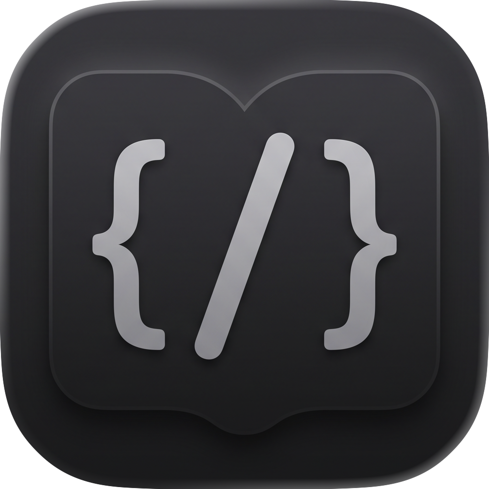
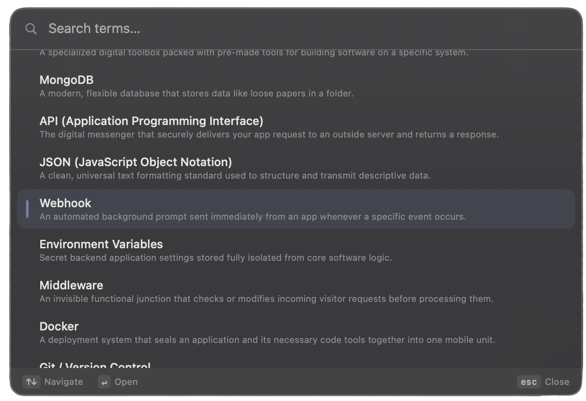
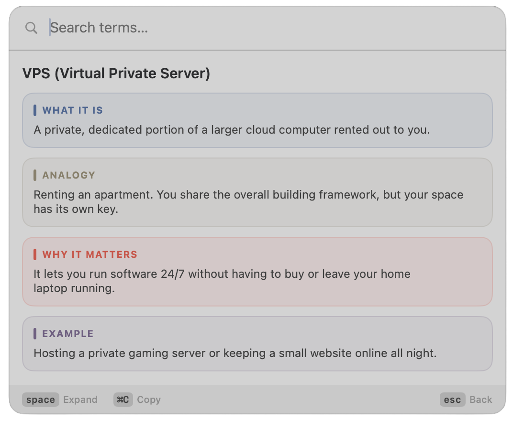
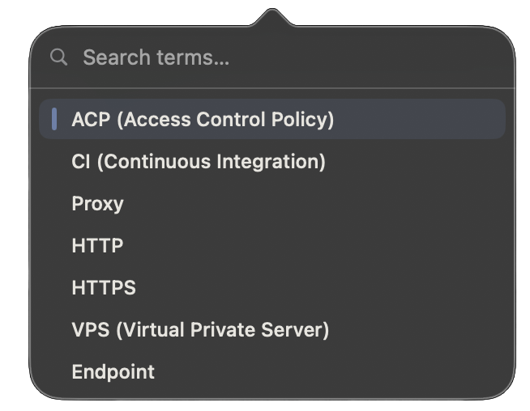

<p align="center">
  
</p>

<h1 align="center">Glossary</h1>

<p align="center">
  A keyboard-first, distraction-free macOS menu-bar glossary.<br>
  Summon it from anywhere, fuzzy-search a term, and learn it in seconds — without ever touching the mouse.
</p>

<p align="center">
  
  
  
  
</p>

<p align="center">
  
</p>
<p align="center">
  
  &nbsp;&nbsp;
  
</p>

---

## Install

Grab `Glossary-x.y.z.dmg` from the [latest release](https://github.com/aka-kika/Glossary/releases),
open it, and drag **Glossary** into **Applications**. Then launch it and press `⌥Esc`.

The DMG is **signed with a Developer ID and notarized by Apple**, so it opens with a
normal double-click — no Gatekeeper "damaged" or "unidentified developer" prompt.

> Prefer to build it yourself? See **Build & run** below. To cut your own signed,
> notarized DMG, use `scripts/release-dmg.sh`.

## Why

Looking up a term shouldn't break your flow. Glossary lives in the menu bar, opens
on a global hotkey, and reveals just enough — a one-line summary first, then an
analogy, then the deep dive — all driven by a single key. It's built to **minimize
cognitive load** while you learn. The fuller rationale lives in [WHY.md](WHY.md).

## Features

- **Global summon** — `⌥Esc` (rebindable) shows/hides the overlay from any app.
- **Clipboard auto-load** — copy a term, summon, and it's already open.
- **Fuzzy search** — type to filter; usage-aware (frecency) ranking floats your
  favorites up without ever beating a better text match.
- **Single-key disclosure** — `Space` reveals the next block (Analogy → Why It
  Matters → Example), then closes them, on a loop.
- **Two presentation modes** — a centered, Raycast-style **Overlay** or a compact
  **Mini** dropdown from the menu bar.
- **Light / Dark / System** theming in the **KIKA** brand palette.
- **Add your own terms** — an editable JSON file, no rebuild required.
- **100% keyboard** — nothing here needs a mouse.

## Keyboard

| Key | Action |
| --- | --- |
| `⌥Esc` *(default)* | Summon / hide (global; rebindable in Settings) |
| Type | Fuzzy-filter terms |
| `↑` / `↓` | Move through results |
| `Enter` | Open the highlighted term |
| `Space` | Reveal the next block; once all are open, close them one by one |
| `Cmd+C` | Copy the active term |
| `Escape` | Back to the list from a term, or dismiss from the list |

## Settings

Open from the menu-bar icon → **Settings…** (or `⌘,`):

- **Hotkey** — pick the 2-key summon chord (⌥Esc, ⌃Esc, ⇧Esc, ⌘Esc, ⌃Space, …).
- **Window style** — Overlay (centered) or Mini (menu-bar dropdown).
- **Panel size** — Small / Medium / Large.
- **Theme** — System / Dark / Light.
- **Launch at login**, **Auto-load from clipboard**, and resets.
- **Glossary** — open/reveal/reload the term file, copy a new-term template, and
  merge in new built-ins.

## Adding terms

On first launch the app seeds an editable file at
`~/Library/Application Support/Glossary/glossary.json`. From then on it's the source
of truth — **add terms without rebuilding**:

1. Settings → **Copy New-Term Template** (the exact JSON shape).
2. **Open Glossary File…**, paste it inside the `[ … ]` list, and fill in the fields.
3. Settings → **Reload**.

```json
{
  "id": "my-term",
  "term": "My Term",
  "whatItIs": "One-sentence plain summary.",
  "analogy": "A vivid everyday comparison.",
  "whyItMatters": "Why it's useful in one sentence.",
  "example": "A concrete example."
}
```

If your edit has a JSON error, the app keeps the built-in terms and tells you. When
an update ships **new** built-ins, they're merged in automatically without touching
your own terms or edits.

## Build & run

Requires Xcode 26 / Swift 6.3.

```bash
swift run Glossary        # run in dev
swift test                # run the unit tests
scripts/build-app.sh      # build a local Glossary.app (ad-hoc signed)
scripts/release-dmg.sh    # build a signed + notarized DMG for distribution
```

`scripts/build-app.sh` produces `Glossary.app` — a menu-bar agent (no Dock icon).
Double-click it, or add it to **System Settings → General → Login Items**, then press
`⌥Esc`. A locally built app is never quarantined, so it just runs.

`scripts/release-dmg.sh` produces the public `Glossary-x.y.z.dmg`: it re-signs the app
with a **Developer ID** + Hardened Runtime, **notarizes** it with Apple, and **staples**
the ticket to both the app and the DMG. Needs a Developer ID Application certificate and
notary credentials stored under a keychain profile — see the header of the script.

## Architecture

- **`GlossaryCore`** (library, fully unit-tested) — `Term`, JSON loader,
  `FuzzyMatcher`, `AppState` (modes, disclosure, frecency), `TermFormatter`,
  `UsageStore`. No AppKit.
- **`Glossary`** (executable) — the AppKit shell: status item, Carbon global hotkey,
  floating `NSPanel` overlay and `NSPopover` mini mode, Settings, and the SwiftUI
  views.

See [WHY.md](WHY.md) for the rationale, [CLAUDE.md](CLAUDE.md) for the build map, and
the [design spec](docs/design-spec.md) for the full design.

## License

[MIT](LICENSE) © 2026 KIKA
